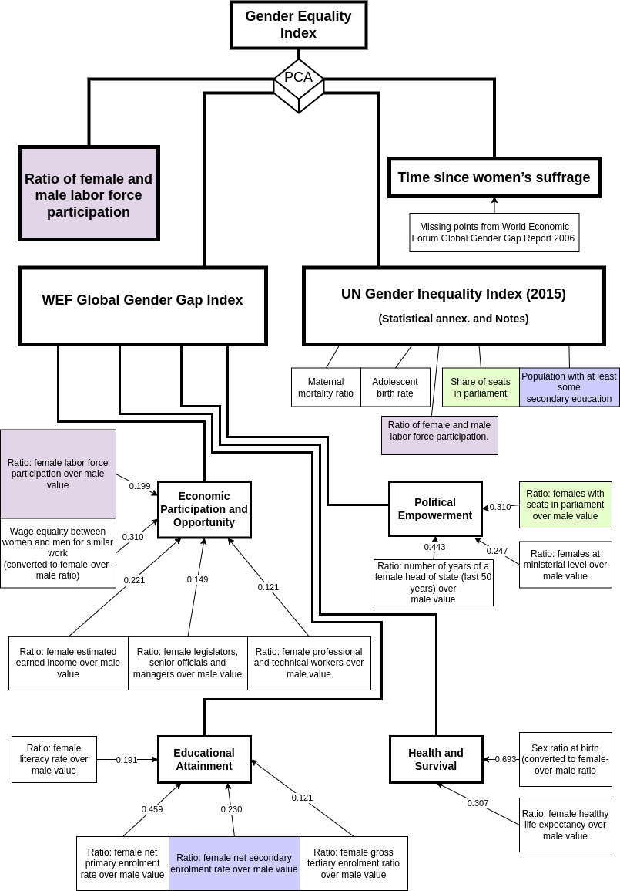

**JEL:**  D010 - Microeconomic Behavior: Underlying Principles, D630 - Equity, Justice, Inequality, and Other Normative Criteria and Measurement, D810 - Criteria for Decision-Making under Risk and Uncertainty, D910 - Micro-Based Behavioral Economics: Role and Effects of Psychological, Emotional, Social, and Cognitive Factors on Decision Making, F000 International Economics: General

**Keywords:** replication study, gender differences, economic preferences

**Data availability:** The code used for this analysis (replication and extended) can be found on GitHub at https://github.com/scerioli/Global-Preferences-Survey

# 1. Introduction

Gender differences concerning the economic behaviors, such as happiness [@SPSU], competition [@CG; @GLL; @KPS], or work preferences [@BG] have been studied in sociology, psychology and economics for many decades. Any scientific knowledge about gender differences and their relation to gender inequality is used nowadays as arguments and counter-arguments for decision and policy-making. Yet, despite the research effort and large body of literature on the topic [REFs], the theoretical understanding of these relations is far from complete. 

Gender-related issues such as gender inequality are becoming an integral part of the agenda for many public and private institutions and organizations. Therefore, it is essential for the stakeholders to reveal, estimate, monitor, and prevent gender inequalities on individual, group and country levels. Within its design, all institutonally recognizedindexes shows that no coutry in the world are approaching equality in econtomic and political domain, while the gap in education and health is closed in a majority of the countries [REF]. The establishing of the full equality within the conceptual model that is quantified by indexes, at the currect speed of improvements one may estimate the achving equality within 100 years [Global Gender Gap Report 2020]. Thus an effective measures to speed up the process may be desired. As we revieal later the indexes itself are not free from flaws and incompletness and were critisized by several authors.

The study of gender differences on a world scale per se is challenging. One of the challenges that hampers the progress is the lack of large and heterogeneous datasets across different social groups and countries. The Gallup World Poll 2012 included a Global Preference Survey conducted on almost 80000 people in 76 countries all around the world that aimed to fill this gap: Covering nearly 90% of the world population representation, with each country having around 1000 participants answering questions related to their time preference (patience), altruism, will of risk-taking, negative and positive reciprocity, and trust. The dataset provides a unique insight into the economic preferences of a heterogeneous number of people. 

The original study published in the Quarterly Journal of Economics [@QJE_Falk, 133 (4) pp. 1645-1692] focused on more general questions about the economic preferences distributions in different countries, trying to explore several covariates from the Gallup World Poll. While, the subsequent article [@FH], replicated in this work, focused explicitly on the gender differences arising from the previous study and reported the evidence for the relationship between gender differences in economic preferences, economic development, and gender equality across many countries. The authors propose two hypotheses to be tested: The first one is that the gender differences will decrease for more economically developed and gender-equal countries, because social roles related to gender are attenuated. The second hypothesis is that, on the contrary, for more economically developed and gender-equal countries, the gender differences will increase because the gender-neutral goal of subsistence is removed and thus people can pursue their real preferences. The data reveals a positive correlation of gender differences in preferences with GDP p/c and with the gender equality of the countries, thus favoring the hypothesis that predicts the increase of the differences as women and men obtain sufficient access to the resources to develop and express their intrinsic preferences independently.

Throughout the study, the authors construct and use a joint measure of gender equality of different countries, coming from different sources (see also the Appendix), providing little to no discussion about the reason in doing so. This is seen as a critical point, since some of the indicators used, such as WEF Global Gender Gap and UNDP Gender Inequality Index are far from being a complete representation of gender inequality, and were heavily criticized by several authors [@SK; @AS; @Permanyer]. 

In this work, we first analize the gender equality index that was used by authors and sub-indexes that were involved into the study. Second, we conduct a pure replication of the article in R language, challenged by the fact that most of the data were either not available anymore, or could not be provided for free (see Appendix, Section 2, "Data Collection, Cleaning, and Standardization"). Third, we extended the original article with the robust regression to address non-normality of the data the and discuss the general extendability, as several methods are given the available data and limitation due to the fact that the data is available not in the rawest form, [Include the multicollinearity]. Fourth, we demonstrate that the fundamental finding is not stable when trying to replace the gender equality index introduced by the authors with the Gender Development index proposed by @SK and recently introduced by the UNDP. Finally, we conclude with the discussion on the gender equality indexes and the importance of accessing its measure on a global level to provide a proof for theories.

NOTE: There are some parts that needs to be adjusted, especially in point 3 and the final one.

# 2. Results

## A composed Gender equality Index and related problematics

<<<<<<< HEAD
The authors in the original article compose a joint measure of gender equality that they denoted as Gender Equality Index (GEI). Our analysis starts with questioning the fact that, throughout the study, the authors construct and use a joint measure of gender equality of different countries, coming from different sources (see also the Appendix), providing little to no discussion about the reason in doing so. This is seen as a critical point, as it was previously showen that the indicators itselft have flaes and limitations, moreover the further combination of them should be justified. We visualized its composition useing a diagram shown in Figure 1. For measurables were used to compose a joint measure, two of them are indexes officially approved byworld organizations, WEF Global Gender Gap and UNDP Gender Inequolity Index, one widely used measurable, ratio of female and male labor force participation, and newly constracted by authors measurable, the time since woman suffrage, presumably to track low-term changes. The WEF Global Gender Gap has a total of fourteen sub-indexes, grouped in four categories: economic partisipation and opportunity, poiltical empowerment, educational attainment, health and survival. UNDP Gender Inequolity Index follows similar logic to cover the same categories that describe different aspects of human life, but utilising only 5 sub-indexes in total, two for health and reproduction-related issues and three others for three remaining categiries. Both indexes were critisied by several authors.  Importantly, the comparison of WEF and UNDP index reveals, that two indexes share three subindexes that we indicate with colors: ratio of female and male labor force partisipation (yellow), share of seats in parliament (green) and enrolement into secondary education (blue). As a theid variable to constract PCA the authors used the ratio of female and male labor force partisipation, already included into the previous two indexes and balanced with other factors (below we also analyse the problematics related to the indexes inself). This prioretization of the famale-to-male ratio factor was not justified, which is further as . The design of WEF Global Gender Gap and UNDP Gender Inequality Index are far from being a complete representation of gender inequality, and were heavily criticized by many authors [@SK; @AS; @Permanyer]. To summarise some of the main critics to them: The Gender Inequality Index from the UNDP is very highly related to the economic development, as it includes reproductive health indicators that can penalize poorly-developed countries, and it has a "inexistent" measure of welfare loss of inequality, because it is based on a calculated gender equality measure that is reported nowhere. (Besides, one of the coefficients that has a highest priority in calcuclaiton of the economic partisipation and opportunity, "wage equality between men and women for similar work" subindex (that indicates how much women recieve more with respect to man for the same work) is a based on can be considered as a best experts guess).

To our best knowledge the indexing based on the was introduces for the first time. Thus, that the *assumption* that suffrage played a long lasting effect on the balance in gender equality looks reasonable but requires inverstigation. First of all, even after the right to vote, many discriminative laws were still in presence and the alligment of law together with executive branch of the goverment and illimination of descrimination (as for example, despite to the right to work, the right to work can be suppressed for several decades), and for a cluster of the countries with slavary, the questions about the suffrage and racial are actually strongly connected (https://www.nature.com/articles/s41599-020-00554-3)[https://www.nature.com/articles/s41599-020-00554-3]. Is there any review on it? [https://www.nber.org/papers/w20864]. Acute changes in GEI should not imply an immediate change in GDEP. Spurious regressions with near-multicollinearity.

[How PCA correlates with other components? Table for components? Plot PCA?  PC1 explained variance 0.4 (Eigenvalues, Component loadings, Bootstrap) [Tools for Composite Indicators Building]

"Handbook on Constructing Composite Indicators". Check linearity (input data is not gaussian, assumptions for PCA does not work). "The Use of Discrete Data in PCA: Theory, Simulations, and Applications to Socioeconomic Indices". PCA on descrete data, PCA ordinal data, https://www.tqmp.org/RegularArticles/vol10-1/p040/p040.pdf]

"The PCA is intrinsically a linear procedure, so it is non-robust, in the sense of
Huber (2003), to various distributional assumptions violations. In particular, if the
distribution of x exhibits high skewness and/or kurtosis, the weights and eigenvalues in
PCA will have higher variances, and converge to their asymptotic distributions slower
(Davis 1977)."

[One of the integral components of the WEF index is the ratio of avarage income for man and women. [check 40000 $]. Another indicator "fairness of the salary" is not a subjective assessment from the World Economic Forum from the executives. Information summary on time since women suffrage: the table does not contain links on the related sources.]

=======
The authors in the original article compose a joint measure of gender equality that they denoted as Gender Equality Index (GEI). We visualized its composition using a diagram shown in Figure 1. Four measurables were used to compose this joint measure: Two of them are indexes officially approved by world organizations, WEF Global Gender Gap and UNDP Gender Inequality Index; one widely used measurable, the ratio of female and male labor force participation; and lastly, a newly constructed by authors measurable, the time since woman suffrage, presumably to track low-term changes. The WEF Global Gender Gap has a total of fourteen sub-indexes, grouped in four categories: economic participation and opportunity, political empowerment, educational attainment, health and survival. UNDP Gender Inequality Index follows similar logic to cover the same categories that describe different aspects of human life, but utilizing only 5 sub-indexes in total, two for health and reproduction-related issues and three others for three remaining categories. 

Both indexes were criticized by several authors [@SK; @AS; @Permanyer]. To summarise some of the main critics to them: The Gender Inequality Index from the UNDP is very highly related to the economic development, as it includes reproductive health indicators that can penalize less-developed countries, and it has a "inexistent" measure of welfare loss of inequality, because it is based on a calculated gender equality measure that is reported nowhere. The WEF Global Gender Gap has a total of fourteen sub-indexes (some of them being the same as for the UNDP GII) where a cap to 1 is applied for those countries where the ratio is higher than 1. This means that countries treating equally men and women are ranked the same as countries disfavoring men. Moreover, it can be argued that, even after the right to vote, many discriminating laws were still in presence and the alignment of law together with executive branch of the government and elimination of discrimination -- for example, despite to the right to vote, the right to work can be suppressed for several decades. Worthy to mention also the question about suffrage and race, that are in many cases strongly connected [@Yang; @NBERw20864]. Thus, that the *assumption* that suffrage played a long lasting effect on the balance in gender equality sounds reasonable but requires further investigation.

Another important aspect is that the comparison of the four indexes used to build the Gender Equality Index shows many repetitions in the datasets used, as one can see in Figure. 1. For instance, the two indexes from WEF and UNDP share three sub-indexes here indicated with different colors: ratio of female and male labor force participation (yellow), share of seats in parliament (green) and enrollment into secondary education (blue). As a third variable to construct their Gender Equality Index, the authors used the ratio of female and male labor force participation, already included into the previous two indexes and balanced with other factors (below we also analyse the problematic related to the indexes themselves). 

{width=70%}

[How PCA correlates with other components? Table for components? Plot PCA?  PC1 explained variance 0.4, "Tools for Composite Indicators Building ", "Handbook on Constructing Composite Indicators". Check linearity. "The Use of Discrete Data in PCA: Theory, Simulations, and Applications to Socioeconomic Indices". PCA on discrete data, PCA ordinal data]
[What are the first and the second component?]
[One of the integral components of the WEF index is the ratio of avarage income for man and women. [check 40000 $]. Another indicator "fairness of the salary" is not a subjective assessment from the World Economic Forum from the executives. Information summary on time since women suffrage: the table does not contain links on the related sources.]

[model on national level: we can measure with higher desritization but hard to compare with global rating]

\newpage
>>>>>>> master

## Pure replication and extended analysis

- We want to compare the important variables here, that are all the ones from the conditional analysis (replication + extended) because when we check the correlation of log GDP and gender equality (both GEI and GDI), we see a big correlation that might cause to troubles if not taken into consideration when doing the analysis. Moreover, as the theorem @Lovell teaches us, this would be the same as performing a linear regression of gender differences on log GDP and gender equality, so why not?

- We want to add specifically the results from the GDI measurements, because these ones show no correlation to the gender differences at all, so this is in contrast to the other result. Note that this is NOT in contrast with our replication that showed us no correlation between the four indices and the gender differences. This is telling us that in principle it doesn't matter what indicator we choose, but it DOES matter if we perform a PCA on indicators. 

In Table 1, we summarise the results of the conditional analysis. We indicate the significance level for each correlation using the following scheme:

Significance $\le$ 0.001 (\*\*\*), $\le$ 0.01 (\*\*), $\le$ 0.05 (\*)

Since the correlation between Log GDP p/c and Gender Index is not negligible (see Figure. 2), we can't ignore the effect of the one on the other. Thus, to understand the effect of the gender differences regressed on economic development, we need to perform this regression conditioning on the gender equality, and vice-versa.

For the two main country-level variables (Log GDP p/c and Gender Equality Index), we see that the replication values tend to agree and be on the same direction (similar slope coefficients and significant p-value) as the original ones. But when we start to check for the single indexes, we see that there are some differences which are worthy to discuss. 

|Variable | Residualized on | Original | Replication | Extended |
--- | --- | --- | --- | -- | 
|Log GDP p/c | Gender Equality Index | 0.5258***  | 0.5673*** | 0.5657*** |
|Gender Equality Index | Log GDP p/c | 0.3192***  | 0.2856* | 0.2972* |
|WEF Global Gender Gap | Log GDP p/c | 0.2327***  | 0.2006* | 0.1917* |
|UN Gender Equality Index | Log GDP p/c | 0.2911  | 0.2355 | 0.2385 | 
|F/M in Labor Force Participation | Log GDP p/c | 0.2453*  | 0.1708 | 0.1684 |
|Years since Women Suffrage | Log GDP p/c | 0.2988**  | 0.1499 | 0.1561 |
|Log GDP p/c | Gender Development Index | -- | 0.7055*** | 0.7214*** |
|Gender Development Index | Log GDP p/c | --  | 0.0307 | 0.0020 |

: Conditional analysis to separate the impacts of economic development and gender equality on gender differences in economic preferences. Reported are the slopes of the linear regressions.

We had to make choices on how to impute data and also how to handle the missing data (see discussion above in paragraph "Methods"). The main imputation on missing data has been done on the "time since women’s suffrage" dataset, that is where we see a substantial difference in the results. Other datasets, on the other hand, has not been treated for missing data but still they present some difference. For instance, the dataset "F/M in Labor Force Participation" in our analysis has a non-statistically significant correlation, while in the original paper they found a correlation with p-value less than 0.05. An hypothesis was that this might be the result of using a different dataset for the GDP (the 2010 USD instead of 2005), but in our opinion this can’t be an explanation but rather a check about how robust the results are. So this question about the differences that were found is kept open.

The most interesting part of the analysis arises from the use of the Gender Development Index in place of the Gender Equality index built by the authors. When the variable conditioning analysis regressing on the Log GDP p/c is done, the correlation between gender differences and GDI vanishes, with slope = 0.031, p-value = 0.801 for the analysis performed using OLS, and slope = 0.002 with p-value = 0.988 for the analysis performed using robust linear regression (Fig. 3). 

This is nevertheless not in contrast with the results found on the single indexes from our replication study, where we see a small correlation of the gender differences with the gender equality indicator, with a small, when not even null, statistical significance.

To further check that no correlation was found for the Gender Development Index when conditioned on economic development, we regressed the single preferences on it and compared the results of the single indexes and the joint Gender Equality Index, when regressed on Log GDP p/c (see Table 2).

|Variable | Altruism | Trust | Pos. Rec. | Neg. Rec. | Risk Taking | Patience |
--- | --- | --- | --- | -- | --- | --- |
|Gender Equality Index (Original) | 0.2050 | 0.3304** | -0.0115 | 0.2788* | 0.1973 | 0.2967* |
|Gender Equality Index (Replication) |  0.2351 | 0.2248 | 0.0570 | 0.1195 | 0.0872 | 0.2621* |
|Gender Development Index (Extended) | -0.1051 | 0.0597 | -0.1695 | 0.0272 | -0.004 | 0.1211 |

Again, we see no statistically significant correlation between the gender differences in single economic preferences and the Gender Development Index, when controlling for the economic development. We find slightly larger correlation factor using the Gender Equality Index in our replication, but only one of them (corresponding to the "patience") is somehow statistically significant below the 5% confidence level. Interestingly, the same small correlations can be seen in the original paper (Fig. S6, @FH_SM), even if a stronger and statistically significant correlation is found for the trust in the original paper.

Looking at these results, we can deduce that:

1. For countries having the same gender development, the gender differences are depending from the economic development of the country, meaning that richer countries have more gender differences than poorer countries, gender development being equal;

2. For countries having the same economic development, the gender differences are independent from the gender development of the country, meaning that there are no gender differences arising from countries having same economics but different gender development.

From this, one could therefore assume that the economic development is the country-level indicator associated with higher changes in gender differences, rather than the gender development of a country. From such a simple analysis is therefore not possible to extract any information regarding the reason for higher gender differences in more economically developed countries. We can only see that, for countries with similar economics, those differences don't exist regardless of how gender developed that countries are. The reason behind the differences might be related to purely economical conditions, that would also make sense since the gender differences here studied are "economical preferences". Can it be that the differences arise where the economic is more developed because of marketing reasons? After all, all the economics here analysed are based on capitalistic systems, meaning that the bigger the economic, the bigger the market. It is an interesting hypothesis that would require further analysis. 

## Multicollenearity of the data and DAG

[Theorem used for residuals and multicollenearity]

[Spurious Regressions and Near-Multicollinearity]

[Frisch–Waugh–Lovell theorem uses inversed matrix that is going to be close to zero in case of collinearity]

[OLS Assumptions in Multiple Regression and their violation]

# 3. Discussion and conclusions

The original study indicates that higher economic development and higher gender equality are associated with an increase in the gender differences in preferences, and therefore rules out the social-role theory over the post-materialistic one: When more resources are available to both men and women, the expression of the gender specific preferences can be seen. Our replication leads to the same conclusions, but we have some open questions regarding unexplained differences that lead to further checks on the results’ robustness. Moreover, we prove that, using a different indicator for the gender inequality in different countries, the result found by @FH does not hold anymore. 

We decided to focus on two main checks for the robustness: The first was to change the model to have a more "relaxed" assumption for the linear regression, and the choice went to robust linear regression. The results are similar to the ones from the replication analysis, meaning that the model is robust enough.

The second check has been the introduction of a different gender equality indicator, the Gender Development Index (from the UNDP). We performed the same analysis done so far, and we could see some differences rising from it:

- The correlations of the GDI and the gender differences at the single preference level differ quite a lot from the ones obtained using the Gender Equality Index (see Table 2). Half of the gender difference preferences are not correlated significantly anymore to the gender indicator, in one case the correlation is a half of the original one, in another case it starts to be significant (while in the original it wasn't). Only for the "altruism" we see the same behavior. This leads to questioning the stability of the measures performed using the Gender Equality Index, because it strongly depends on the way this indicator is built, making it hard for the researchers to claim which ones could be the best for the study that one wants to address;

- The correlation between GDI and gender differences is positive and statistically significant, although the strength of the correlation is somewhat less than the one for the GEI used by the authors;

- Lastly, the most important figure to look at is the variable conditioning for the whole analysis, because the gender index is very often intertwined to it, and because in general one can immediately get an answer to the question "how much variance is explained by the variable chosen, independently by the country economic development". The result of this analysis is that the gender differences residualised on the economic develooment do not show a dependency on the GDI (also residualised on economic development), while the vice-versa applies (meaning, there is a strong and statistically significant correlation between gender differences and economic development, both residualised on the GDI). This result arises many questions that are beyond the scope of this analysis.

[the role of coveing different levels of power]

# References

