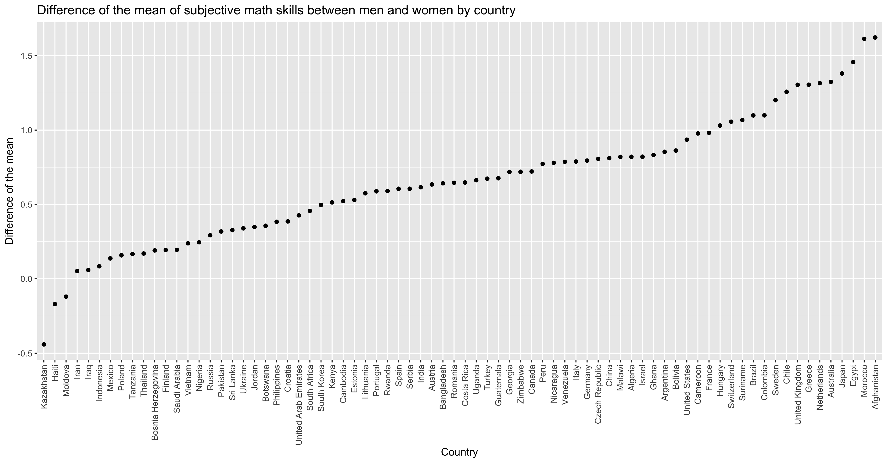

```{r setup, include=FALSE}
knitr::opts_chunk$set(echo = TRUE)
```

## Do girls dislike math or do they just feel more insecure about it?

While studying the dataset of the 2012 Gallup World Poll of the [Global Survey Preference](https://www.briq-institute.org/global-preferences/home), we came across some interesting facts that are definitely nothing new to people in the field, but that we think it is anyhow nice to share. As a part of the survey, about 1000 respondents in each of 76 countries were asked to answer this question:

_How well does the following statement describe you as a person? I am good at math._

_Please indicate your answer on a scale from 0 to 10. A “0” means “does not describe me at all” and a “10” means “describes me perfectly”. You can also use any numbers between 0 and 10 to indicate where you fall on the scale, like 0, 1, 2, 3, 4, 5, 6, 7, 8, 9, 10._

The answer to this question is called “subjective math skills” in the field and known to represent the self-estimation of the respondent in math abilities.

We noticed that in many countries, on average, women tended to be less secure about their math abilities.

We calculated the average subjective math skills by country and by gender, and then plotted the difference between the average of the male subjective math skills minus the female one:



Only 3 out of 76 countries have a negative difference, meaning that women tend to consider themselves good at math, while men tend to consider themselves worse. All the other countries show the opposite. 

Checking out the single countries, we can learn something more interesting about the differences, that can be summarised as 

*the mean is not a good representative of the population* (sounds obvious, doesn’t it? alas not for everyone…)

For example, in Italy and Germany the differences between women and men in subjective math skills are almost identical. But once we plot the actual distributions, we see that they are very different from each other. In Italy, the mode (the most frequent answer) of both distributions is 6. In Germany, on the contrary, the mode for the two distributions is different: Males tend to assign themselves a score of 8, while females are much more moderate and assign more 5s.


To plot the same differences between man and women for all countries (find yours!), we plot a 2D-heatmap, where blue colour represents a negative difference (thus a lower number of female answered that value of the subjective math skills with respect to males), and red represents a positive difference (a higher number of female answered that value with respect to males).


The order of the countries is the same as the one displayed for the mean of the differences, but this time one can clearly see the pattern of the differences. Higher values of differences are stressed by more intense colour, while white represents the absence of difference.

The data raises many questions but unfortunately can’t provide answers:

- What is the distribution of math skills (not subjective, but real) in individuals across countries?

- How much are the countries gender-biased toward the idea “women are bad at math”?

- Is there a correlation between the stereotype and the performance in math? Or between the stereotype and the self-perception of one owns abilities in math?

- Is the difference due to the stereotype “women are bad at math” or is the difference to be associated with lower self-esteem among women?

#### What kind of question would you ask? Feel free to leave a comment!
