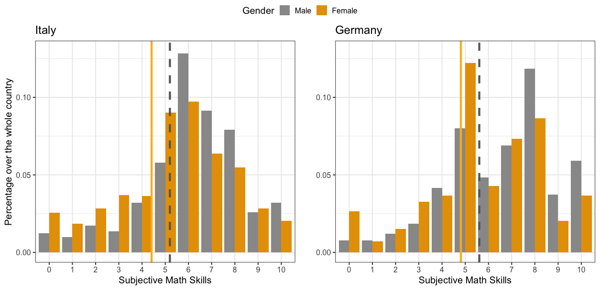
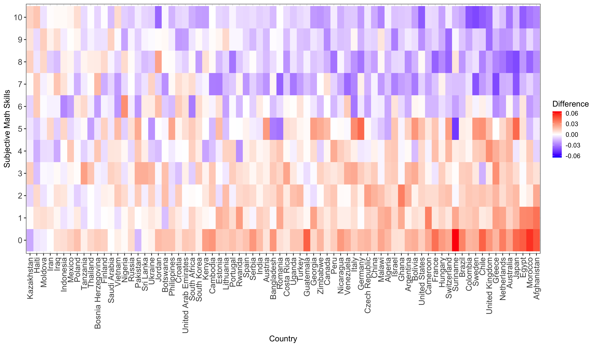

```{r setup, include=FALSE}
knitr::opts_chunk$set(echo = TRUE)
```

## Donne e matematica: lo stereotipo senza frontiere

Analizzando dei dati presi dal "2012 Gallup World Poll", abbiamo notato alcune peculiarita' interessanti che non sono assolutamente nuove per le persone del settore, ma che ci sembra comunque interessante condividere. I dati sono presi da un sondaggio svoltosi in 76 Paesi, per un totale di circa 1000 rispondenti per Paese, in cui una delle domande poste era la seguente:

_Quanto la seguente frase ti rappresenta come persona? Io me la cavo bene in matematica_

_Per favore indica la risposta su una scala da 0 a 10, dove 0 significa "Non mi descrive per nulla" e 10 "Mi descrive perfettamente". E' possibile utilizzare ogni numero tra 0 e 10 per indicare il proprio posizionamento sulla scala, ad esempio 0, 1, 2, 3, 4, 5, 6, 7, 8, 9, 10._

La risposta a questa domanda (il numero indicato tra 0 e 10) viene indicata come "abilita' (o competenze) matematiche soggettive" (in inglese "subjective math skill", per i grafici successivi), e rappresenta appunto la percezione che ognuno ha delle proprie abilita' matematiche.

Si puo' notare che in molti Paesi, in media, le donne tendono a essere meno sicure delle loro abilita' matematiche rispetto agli uomini.

Abbiamo calcolato la media delle competenze matematiche soggettive per Paese e per genere, e abbiamo poi tracciato la differenza tra la media delle competenze matematiche soggettive maschili meno quella femminile:


La differenza misurata e' in punti assegnati, quindi una differenza uguale a 1 sull'asse verticale significa che in media in quel Paese le donne si sono assegnate un punto in meno rispetto a quello che si sono assegnati in media gli uomini. Solo 3 Paesi su 76 hanno una differenza negativa, che significa che le donne tendono a considerarsi piu' brave in matematica rispetto a come si considerano gli uomini in quel Paese. Tutti gle altre nazioni invece mostrano un andamento contrario. 

Controllando i singoli Paesi, possiamo imparare qualcosa di più interessante sulle differenze, che puo' essere riassunto come 

*la media non è un buon rappresentante della popolazione* (suona ovvio, vero? Purtroppo non lo è per tutti...)

Per esempio, in Italia e in Germania le differenze tra donne e uomini nelle competenze soggettive in matematica sono quasi identiche. Ma una volta tracciate le distribuzioni reali, vediamo che queste sono molto diverse tra loro. In Italia, la moda (ossia la risposta più frequente) di entrambe le distribuzioni corrisponde a 6. In Germania, al contrario, la moda delle due distribuzioni è diversa: i maschi tendono ad assegnarsi un punteggio di 8, mentre le femmine sono molto più moderate e si assegnano maggiormente 5.



Per tracciare le stesse differenze tra uomini e donne per tutti i Paesi (ti invitiamo a trovare il tuo!), abbiamo creato una mappa termica 2D, dove il colore blu rappresenta una differenza negativa (quindi un numero inferiore di donne ha risposto a quel valore delle abilità matematiche soggettive rispetto ai maschi) e il rosso rappresenta una differenza positiva (un numero maggiore di donne ha risposto a quel valore rispetto ai maschi).



L'ordine dei paesi è lo stesso di quello visualizzato per la media delle differenze, ma questa volta si può vedere chiaramente l'andamento delle differenze: un colore più intenso indica differenze piu' marcate, mentre il bianco rappresenta l'assenza di differenze.

I dati sollevano molte domande ma purtroppo non possono fornire risposte:

- Qual è la distribuzione delle competenze matematiche (non soggettive, ma reali) negli individui nei vari Paesi?

- Quanto i Paesi considerati sono orientati verso l'idea che "le donne non sono brave in matematica"?

- C'è una correlazione tra lo stereotipo e la performance in matematica? O tra lo stereotipo e l'autopercezione delle proprie capacità in matematica?

- La differenza è dovuta allo stereotipo "le donne non sono brave in matematica" o è invece da associare alla minore autostima delle donne?

#### Che altre domande faresti? Sentiti liber* di lasciare un commento!
